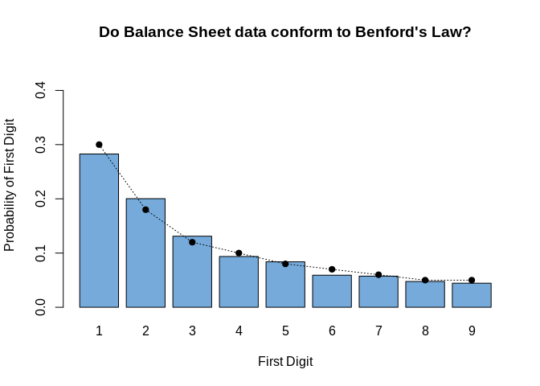

<!-- README.md is generated from README.Rmd. Please edit that file -->

# FDScraper

The goal of FDScraper is to scrape and analyze data from fd.nl (‘Het
Financieele Dagblad’).

## Installation

You can install the development version of FDScraper from Github with:

``` r
# install.packages("devtools")
devtools::install_github("Glender/FDscraper")
```

## A simple example: scraping balance sheet data from fd.nl

The package provides easy to use functions to scrape existing key
figures from beurs.fd.nl:

``` r
library(FDScraper)

## scrape balance sheet data from Heineken
heineken_data <- extract_balance_data("https://beurs.fd.nl/noteringen/11770/heineken/kerncijfers")
print(heineken_data)
#> # A tibble: 23 x 6
#>    X1                           X2     X3     X4     X5     X6    
#>    <chr>                        <chr>  <chr>  <chr>  <chr>  <chr> 
#>  1 Balans (bedragen in € mln)   2021   2020   2019   2018   2017  
#>  2 Immateriële vaste activa     20.762 15.767 17.769 17.459 17.670
#>  3 Materiële vaste activa       12.401 11.551 13.269 11.359 11.117
#>  4 Financiële vaste activa      4.148  4.437  4.868  2.021  2.954 
#>  5 Vaste activa                 39.272 33.612 38.085 32.886 32.786
#>  6 Voorraden                    2.438  1.958  2.213  1.920  1.814 
#>  7 Debiteuren                   2.376  1.768  2.913  2.588  2.582 
#>  8 Overige vlottende activa     1.961  1.857  2.179  2.047  1.045 
#>  9 Effecten en liquide middelen 3.248  4.000  1.821  2.903  2.442 
#> 10 Vlottende activa             9.578  9.020  8.419  9.070  8.248 
#> # … with 13 more rows

# Or from Ahold Delhaize
ahold_delhaize_data <- extract_balance_data("https://beurs.fd.nl/noteringen/11755/ahold-delhaize/kerncijfers")
print(ahold_delhaize_data)
#> # A tibble: 23 x 6
#>    X1                           X2     X3     X4     X5     X6    
#>    <chr>                        <chr>  <chr>  <chr>  <chr>  <chr> 
#>  1 Balans (bedragen in € mln)   2021   2020   2019   2018   2017  
#>  2 Immateriële vaste activa     12.770 11.565 12.060 12.013 11.634
#>  3 Materiële vaste activa       20.848 18.151 17.825 11.147 10.689
#>  4 Financiële vaste activa      952    966    1.112  865    880   
#>  5 Vaste activa                 36.128 31.764 31.920 24.489 23.901
#>  6 Voorraden                    3.728  3.245  3.347  3.196  3.077 
#>  7 Debiteuren                   1.055  1.122  991    940    917   
#>  8 Overige vlottende activa     1.558  1.081  923    464    698   
#>  9 Effecten en liquide middelen 2.993  2.933  3.717  3.122  4.581 
#> 10 Vlottende activa             9.584  8.927  9.570  8.842  9.970 
#> # … with 13 more rows
```

Although this is nice to have, it doesn’t provide us with a lot of
numbers to play with. Therefore, the package also provides a function to
find many urls from a broad range of companies:

``` r
# we define two urls that contain a lot of references to companies
urls <- c(
  "https://beurs.fd.nl/analyse/amsterdam/aex/",
  "https://beurs.fd.nl/analyse/amsterdam/midkap/"
)

# scrape all sites
websites <- scrape_fd_urls(urls)

# show the first ten urls that we scraped
print(websites[1:10])
#>  [1] "https://beurs.fd.nl/noteringen/613007/adyen-nv/kerncijfers"     
#>  [2] "https://beurs.fd.nl/noteringen/11754/aegon/kerncijfers"         
#>  [3] "https://beurs.fd.nl/noteringen/11755/ahold-delhaize/kerncijfers"
#>  [4] "https://beurs.fd.nl/noteringen/11756/akzo-nobel/kerncijfers"    
#>  [5] "https://beurs.fd.nl/noteringen/11895/arcelormittal/kerncijfers" 
#>  [6] "https://beurs.fd.nl/noteringen/11808/asmi/kerncijfers"          
#>  [7] "https://beurs.fd.nl/noteringen/16923/asml/kerncijfers"          
#>  [8] "https://beurs.fd.nl/noteringen/11820/besi/kerncijfers"          
#>  [9] "https://beurs.fd.nl/noteringen/11764/dsm/kerncijfers"           
#> [10] "https://beurs.fd.nl/noteringen/11770/heineken/kerncijfers"
```

Next, we can scrape all the balance data for each company with
`the scrape_fd_data` function:

``` r
# scrape all the data of the 50 websites
data <- scrape_fd_data(websites)
#> Scraped and merged data from: adyen-nv 
#> Scraped and merged data from: aegon 
#> Scraped and merged data from: ahold-delhaize 
#> Scraped and merged data from: akzo-nobel 
#> Scraped and merged data from: arcelormittal 
#> Scraped and merged data from: asmi 
#> Scraped and merged data from: asml 
#> Scraped and merged data from: besi 
#> Scraped and merged data from: dsm 
#> Scraped and merged data from: heineken 
#> Scraped and merged data from: imcd 
#> Scraped and merged data from: ing 
#> Scraped and merged data from: just-eat-takeaway 
#> Scraped and merged data from: kpn 
#> Scraped and merged data from: nn-group 
#> Scraped and merged data from: philips-koninklijke 
#> Scraped and merged data from: prosus 
#> Scraped and merged data from: randstad-nv 
#> Scraped and merged data from: relx 
#> Scraped and merged data from: shell-plc 
#> Scraped and merged data from: signify-nv 
#> Scraped and merged data from: umg 
#> Scraped and merged data from: unibail-rodamco-westfield 
#> Scraped and merged data from: unilever-plc 
#> Scraped and merged data from: wolters-kluwer 
#> Scraped and merged data from: aalberts-nv 
#> Scraped and merged data from: abn-amro-bank-n-v 
#> Scraped and merged data from: amg 
#> Scraped and merged data from: air-france-klm 
#> Scraped and merged data from: alfen-n-v 
#> Scraped and merged data from: aperam 
#> Scraped and merged data from: arcadis 
#> Scraped and merged data from: asr-nederland 
#> Scraped and merged data from: basic-fit 
#> Scraped and merged data from: boskalis 
#> Scraped and merged data from: corbion 
#> Scraped and merged data from: ctp 
#> Scraped and merged data from: fagron 
#> Scraped and merged data from: flow-traders 
#> Scraped and merged data from: fugro 
#> Scraped and merged data from: galapagos
#> Warning in clean_balance_data(data): NAs introduced by coercion
#> Scraped and merged data from: inpost 
#> Scraped and merged data from: intertrust 
#> Scraped and merged data from: jde-peets 
#> Scraped and merged data from: oci 
#> Scraped and merged data from: postnl 
#> Scraped and merged data from: sbm-offshore 
#> Scraped and merged data from: tkh 
#> Scraped and merged data from: vopak 
#> Scraped and merged data from: wdp
```

Now we have collected all the data from those 50 companies, we can
perform some simple analyzes. For example, we first gonna remove
missings, to deal with the warning message, and then we are going to
check whether Benford’s Law applies on these numbers.

``` r
# only available via https://github.com/Glender/BenfordStats
library(BenfordStats)

# remove missings
results <- data[!is.na(data)]

# calculate observed and expected
first_digit_data <- BenfordStats::first_digit(results)

# We also calculate the expected probability of the first digit 
# for the first 9 numbers - those are our benchmark
expected <- round(BenfordStats::prob_first_digit(1:9), 2)
```

Finally, we are going to plot the results:

``` r
plot <- barplot(
  prop.table(table(first_digit_data)),
  ylim=c(0, .45),
  col= "#75AADB",
  main="Do Balance Sheet data conform to Benford's Law?",
  xlab = "First Digit",
  ylab = "Probability of First Digit"
)

lines(x = plot, y = expected, lty = 3)
points(x = plot, y = expected, pch = 19)
```

 In
conclusion, we can say that in general our observed data closely follows
Benford’s Law. Of course, it is not a perfect fit, that can not be
expected based on our limited sample size.
